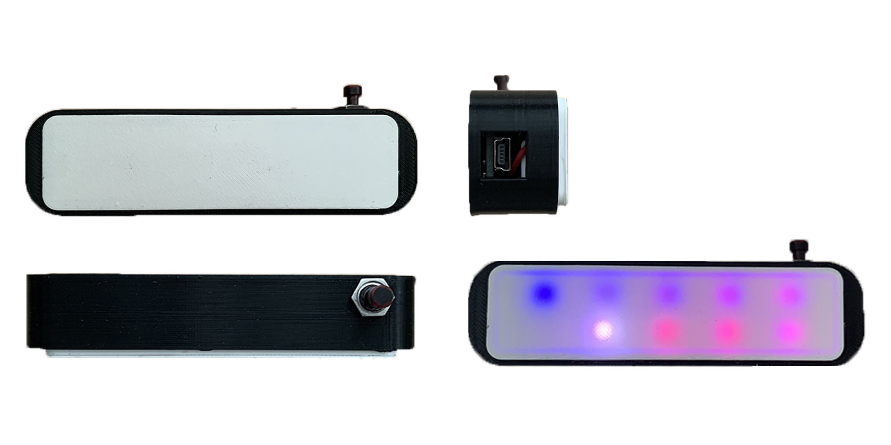
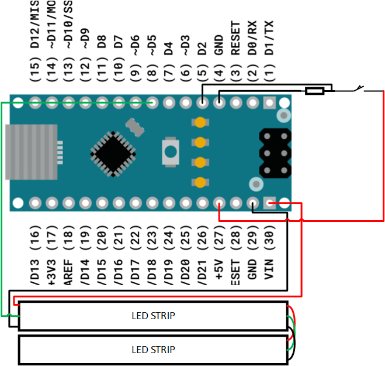

# ⌛ Focus Timer

Funky timer made to focus for a certain amount of time. After that time is reached the LEDs blinks and that tells you to take a **short break**.               

## ⚙️ Hardware

What you will need to build this project :
-  1x [Arduino Nano](https://fr.aliexpress.com/item/4000903444456.html?spm=a2g0o.productlist.0.0.5dc2557dnw2m26&algo_pvid=688f4c30-4102-452f-874a-0d5c8fb5387d&algo_exp_id=688f4c30-4102-452f-874a-0d5c8fb5387d-17&pdp_ext_f=%7B%22sku_id%22%3A%2210000010480222243%22%7D&pdp_npi=1%40dis%7CCHF%7C%7C5.79%7C%7C%7C%7C%7C%402101d68d16512131606552773e5b47%7C10000010480222243%7Csea)
- 1x [WS2812B LEDs](https://fr.aliexpress.com/item/2036819167.html?spm=a2g0o.order_list.0.0.370c5e5bdFYsjG&gatewayAdapt=glo2fra) (Only needs 20 LEDs for the project)
- 1x 2pins button
- 1x 200ohm resistor
- 6x wires
- Glue
- Self-confidence 

## 📷 Pictures 

## 📐 Diagram

## 🧊 3D Models

- [Black Case](./readmeAssets/models/focusTimerCase.stl) (STL)
- [LEDs Case](./readmeAssets/models/focusTimerLedCase.stl) (STL)
